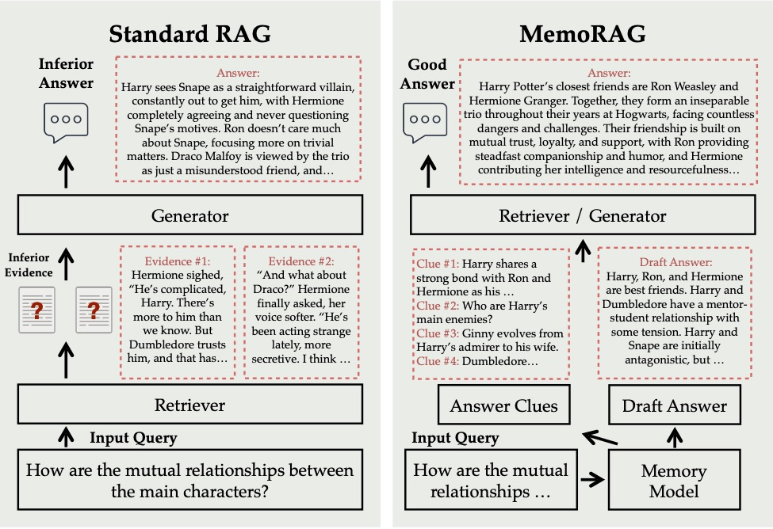

# <div align="center">MemoRAG: Moving Towards Next-Gen RAG Via Memory-Inspired Knowledge Discovery<div>

<div align="center">
<p><strong>Empowering RAG with a memory-based data interface for all-purpose applications!</strong></p>
<a href="https://arxiv.org/abs/2409.05591" target="_blank"></a>
<a href="https://huggingface.co/TommyChien/memorag-qwen2-7b-inst" target="_blank"></a>
<a href="https://github.com/"></a>
<a></a>
</div>

<h4 align="center">

<p>
<a href="#rocket-quick-start">Quick-Start</a> |
<a href="#mag_right-roadmap">Roadmap</a> |
<a href="#notebook-usage">Usage</a> |
<a href="#memorag-demo"> Demo</a> |
<a href="#dataset">Dataset</a> |
<a href="#raised_hands-faqs"> FAQs</a> 
</p>

## Overview

**MemoRAG** is an innovative RAG framework built on top of a highly efficient, super-long memory model. Unlike standard RAG, which primarily handles queries with explicit information needs, MemoRAG leverages its memory model to achieve a global understanding of the entire database. By recalling query-specific clues from memory, MemoRAG enhances evidence retrieval, resulting in more accurate and contextually rich response generation.​


<p align="center">

</p>

## MemoRAG Demo
We will provide a toy demo to demonstrate MemoRAG, you can try with the following scripts:

```python
streamlit run demo/demo.py
```
Afterwards, you can view the demo as below:

<div style="display: flex; justify-content: space-around;">
  <div style="text-align: center;">
    
  </div>
</div>

## :page_with_curl: Changelog
[21/09/24] MemoRAG introduces Lite mode, enabling memory-augmented RAG processing for millions of tokens with just a few lines of code. For more details, refer to the [`examples`](https://github.com/qhjqhj00/MemoRAG/blob/tommy-dev-lite/examples/memorag_lite.ipynb) notebook.

[13/09/24] MemoRAG adds `Meta-Llama-3.1-8B-Instruct` and `Llama3.1-8B-Chinese-Chat` as the Memory Model, see [`examples`](https://github.com/qhjqhj00/MemoRAG/blob/main/examples/longllm_as_memory.ipynb). 

[10/09/24] We release MemoRAG's [`Technical Report`](https://arxiv.org/pdf/2409.05591).

[09/09/24] You can try MemoRAG on [`Google Colab`](https://colab.research.google.com/drive/1fPMXKyi4AwWSBkC7Xr5vBdpPpx9gDeFX?usp=sharing) for free.

[05/09/24] A Qwen2-based memory model is available at [`TommyChien/memorag-qwen2-7b-inst`](https://huggingface.co/TommyChien/memorag-qwen2-7b-inst).

[03/09/24] A Mistral-based memory model is available at [`TommyChien/memorag-mistral-7b-inst`](https://huggingface.co/TommyChien/memorag-mistral-7b-inst).

[01/09/24] The project launched! 

## :sparkles: Features


- **Global Memory**: Handles up to **1 million tokens** in a single context, providing comprehensive understanding across massive datasets.
- **Optimizable & Flexible**: Adapts to new tasks with ease, achieving optimized performance with just a few hours of additional training.
- **Contextual Clues**: Generates precise clues from global memory, bridging raw input to answers and unlocking **hidden insights** from complex data.
- **Efficient Caching**: Speeds up context pre-filling by **up to 30x**, with support for caching chunking, indexing, and encoding.
- **Context Reuse**: Encodes long contexts **once** and supports repeated usage, boosting efficiency in tasks that require recurring data access.

## :mag_right: Roadmap
**MemoRAG**  is currently under active development, with resources and prototypes continuously being published at this repository.
- [x] Codes / Models / Dataset Release 
- [x] Support OpenAI/Azure models
- [x] Technical Report Release
- [x] Support Chinese 
- [ ] Demo Codes Release
- [ ] Training Codes for Memory model Release
- [ ] **Speed Up Inference**
- [ ] **Integrate Any Retrieval Methods**
- [ ] **Enrich the Memory Ability**

Note: The **recent goals** of MemoRAG are to achieve **light-weight optimization** through engineering improvements and to **enhance its memory capabilities**, enabling it to adapt to a wider range of applications and **support longer context** (e.g., more than one million tokens). 


## :rocket: Quick Start
:free: **You can directly try MemoRAG on [`Google Colab`](https://colab.research.google.com/drive/1fPMXKyi4AwWSBkC7Xr5vBdpPpx9gDeFX?usp=sharing) for free.**

In this notebook, we run the complete MemoRAG pipeline (Memory Model + Retriever + Generation Model) on a single T4 GPU with 15GiB of memory provided by Google Colab. Despite the limited resources, MemoRAG can process half of the content from [the example book](https://github.com/qhjqhj00/MemoRAG/blob/main/examples/harry_potter.txt) (~68K tokens) and perform all of its functions.

### Installation

To use Memorizer and MemoRAG, you need to have Python installed along with the required libraries. You can install the necessary dependencies using the following command:

**Install Dependencies**
```bash
pip install torch==2.3.1
conda install -c pytorch -c nvidia faiss-gpu=1.8.0
```

**Install from source**

```shell
# clone this repo first
cd MemoRAG
pip install -e .
```

**Install via pip**
```
pip install memorag
```

For **Quick Start**,
We provide a notebook to illustrate all functions of MemoRAG [here](https://github.com/qhjqhj00/MemoRAG/blob/main/examples/example.ipynb).


## :notebook: Usage

### Lite Mode of MemoRAG :new: :new: :new: 
We introduce the Lite Mode of MemoRAG, designed to offer a quick and user-friendly experience with the MemoRAG pipeline. With just a few lines of code, you can easily try MemoRAG. While we recommend starting with a GPU that has 24GiB of memory, a 16GiB GPU can also handle the pipeline under default settings in most cases.


```python
from memorag import MemoRAGLite
pipe = MemoRAGLite()
context = open("examples/harry_potter.txt").read()
pipe.memorize(context, save_dir="harry_potter", print_stats=True)

query = "What's the book's main theme?"
print(pipe(query))
```
MemoRAG Lite is simple to use, supporting English or Chinese contexts of up to millions of tokens. Although it may work with other languages, performance could degrade since the default prompts are in English. For more details on MemoRAG Lite, please refer to the [`examples`](https://github.com/qhjqhj00/MemoRAG/blob/tommy-dev-lite/examples/memorag_lite.ipynb) notebook."


### Basic Usage of MemoRAG
MemoRAG is easy to use and can be initialized with HuggingFace models directly. By using the `MemoRAG.memorize()` method, the memory model builds a global memory over a long input context. Empirically, with default parameter settings, `TommyChien/memorag-qwen2-7b-inst` can handle contexts of up to 400K tokens, while `TommyChien/memorag-mistral-7b-inst` can manage contexts up to 128K tokens. By increasing the `beacon_ratio` parameter, the model’s capacity to handle longer contexts can be extended. For example, `TommyChien/memorag-qwen2-7b-inst` can process up to one million tokens with `beacon_ratio=16`.


```python
from memorag import MemoRAG

# Initialize MemoRAG pipeline
pipe = MemoRAG(
    mem_model_name_or_path="TommyChien/memorag-mistral-7b-inst",
    ret_model_name_or_path="BAAI/bge-m3", 
    gen_model_name_or_path="mistralai/Mistral-7B-Instruct-v0.2", # Optional: if not specify, use memery model as the generator
    cache_dir="path_to_model_cache",  # Optional: specify local model cache directory
    access_token="hugging_face_access_token",  # Optional: Hugging Face access token
    beacon_ratio=4
)

context = open("examples/harry_potter.txt").read()
query = "How many times is the Chamber of Secrets opened in the book?"

# Memorize the context and save to cache
pipe.memorize(context, save_dir="cache/harry_potter/", print_stats=True)

# Generate response using the memorized context
res = pipe(context=context, query=query, task_type="memorag", max_new_tokens=256)
print(f"MemoRAG generated answer: \n{res}")
```

When running the above code, **the encoded key-value (KV) cache, Faiss index, and chunked passages are stored** in the specified `save_dir`. Afterward, if the same context is used again, the data can be quickly loaded from the disk:

```python
pipe.load("cache/harry_potter/", print_stats=True)
```

Typically, loading cached weights is highly efficient. For example, **encoding, chunking, and indexing a 200K-token context takes approximately 35 seconds** using `TommyChien/memorag-qwen2-7b-inst` as the memory model, **but only 1.5 seconds when loading from cached files.**

### Using Long LLMs as Memory Model :new: :new: :new: 
Recent LLMs have become effective memory models due to their expanding context windows. MemoRAG now supports leveraging these long-context LLMs as memory models, utilizing [`MInference`](https://github.com/microsoft/MInference) to optimize context prefilling. We have tested `Meta-Llama-3.1-8B-Instruct` and `Llama3.1-8B-Chinese-Chat` as memory models, both of which natively support a 128K context length. We are currently exploring additional suitable LLMs and optimizing strategies to enhance the memory mechanisms and context length further. For detailed usage instructions, please refer to the provided scripts and the [`notebook`](https://github.com/qhjqhj00/MemoRAG/blob/main/examples/longllm_as_memory.ipynb):

```python
from memorag import MemoRAG
model = MemoRAG(
    mem_model_name_or_path="shenzhi-wang/Llama3.1-8B-Chinese-Chat",    # For Chinese
    # mem_model_name_or_path="meta-llama/Meta-Llama-3.1-8B-Instruct",  # For English
    ret_model_name_or_path="BAAI/bge-m3",
    # cache_dir="path_to_model_cache",  # to specify local model cache directory (optional)
    # access_token="hugging_face_access_token"  # to specify local model cache directory (optional)
    )
```
Afterward, you can use MemoRAG's functions as usual. 


### Summarization Task

To perform summarization tasks, use the following script:

```python
res = pipe(context=context, task_type="summarize", max_new_tokens=512)
print(f"MemoRAG summary of the full book:\n {res}")
```


### Using APIs as Generators

If you want to use APIs as a generator, refer to the script below:

```python
from memorag import Agent, MemoRAG

# API configuration
api_dict = {
    "endpoint": "",
    "api_version": "2024-02-15-preview",
    "api_key": ""
}
model = "gpt-35-turbo-16k"
source = "azure"

# Initialize Agent with the API
agent = Agent(model, source, api_dict)
print(agent.generate("hi!"))  # Test the API

# Initialize MemoRAG pipeline with a customized generator model
pipe = MemoRAG(
    mem_model_name_or_path="TommyChien/memorag-qwen2-7b-inst",
    ret_model_name_or_path="BAAI/bge-m3",
    cache_dir="path_to_model_cache",  # Optional: specify local model cache directory
    customized_gen_model=agent,
)

# Load previously cached context
pipe.load("cache/harry_potter_qwen/", print_stats=True)

# Use the loaded context for question answering
query = "How are the mutual relationships between the main characters?"
context = open("harry_potter.txt").read()

res = pipe(context=context, query=query, task_type="memorag", max_new_tokens=256)
print(f"MemoRAG with GPT-3.5 generated answer: \n{res}")
```

### Supported APIs for Generators

The built-in `Agent` object supports models from both `openai` and `deepseek`. Below are the configurations for initializing these models:

```python
# Using deepseek models
model = ""
source = "deepseek"
api_dict = {
    "base_url": "",
    "api_key": ""
}

# Using openai models
model = ""
source = "openai"
api_dict = {
    "api_key": ""
}
```


### Usage for Memory Model
The Memory model can be used independently to store, recall, and interact with the context. Here’s an example:

```python
from memorag import Memory

# Initialize the Memory model
memo_model = Memory(
    "TommyChien/memorag-qwen2-7b-inst",
    cache_dir="path_to_model_cache",  # Optional: specify local model cache directory
    beacon_ratio=4  # Adjust beacon ratio for handling longer contexts
)

# Load and memorize the context
context = open("harry_potter.txt").read()
memo_model.memorize(context)

# Save the memorized context to disk
memo_model.save("cache/harry_potter/memory.bin")

# Query the model for answers
query = "How are the mutual relationships between the main characters?"

res = memo_model.answer(query)
print("Using memory to answer the query:\n", res)

# Recall text clues for evidence retrieval
res = memo_model.recall(query)
print("Using memory to recall text clues to support evidence retrieval:\n", res)

# Rewrite the query into more specific surrogate queries
res = memo_model.rewrite(query)
print("Using memory to rewrite the input query into more specific surrogate queries:\n", res)
```

### Usage for Memory-Augmented Retrieval
In addition to the standalone Memory Model, MemoRAG provides memory-augmented retrieval functionality. This allows for improved evidence retrieval based on recalled clues from memory.

```python
from memorag import MemoRAG

# Initialize MemoRAG pipeline
pipe = MemoRAG(
    mem_model_name_or_path="TommyChien/memorag-qwen2-7b-inst",
    ret_model_name_or_path="BAAI/bge-m3",
    cache_dir="path_to_model_cache",  # Optional: specify local model cache directory
    access_token="hugging_face_access_token"  # Optional: Hugging Face access token
)

# Load and memorize the context
test_txt = open("harry_potter.txt").read()
pipe.memorize(test_txt, save_dir="cache/harry_potter/", print_stats=True)

# Define the query
query = "How are the mutual relationships between the main characters?"

# Recall clues from memory
clues = pipe.mem_model.recall(query).split("\n")
clues = [q for q in clues if len(q.split()) > 3]  # Filter out short or irrelevant clues
print("Clues generated from memory:\n", clues)

# Retrieve relevant passages based on the recalled clues
retrieved_passages = pipe._retrieve(clues)
print("\n======\n".join(retrieved_passages[:3]))
```

### Evaluation on Benchmark

Below are experiments results for the memory model, incorporating with three generation models.
<table>
    <caption>We test MemoRAG on three benchmarks. The best results of each block are in bold.</caption>
    <thead>
        <tr>
            <th>Dataset</th>
            <th>NarrativeQA</th>
            <th>Qasper</th>
            <th>MultifieldQA</th>
            <th>Musique</th>
            <th>2Wiki</th>
            <th>HotpotQA</th>
            <th>MultiNews</th>
            <th>GovReport</th>
            <th>En.sum</th>
            <th>En.qa</th>
            <th>Fin</th>
            <th>Legal</th>
            <th>Mix</th>
        </tr>
        <tr>
            <td></td>
            <td colspan="8"><strong>LongBench</strong></td>
            <td colspan="2"><strong>InfBench</strong></td>
            <td colspan="3"><strong>UltraDomain</strong></td>
        </tr>
    </thead>
    <tbody>
        <tr>
            <td colspan="13"><strong>Generator: Llama3-8B-Instruct-8K</strong></td>
        </tr>
        <tr>
            <td>Full</td>
            <td>21.3</td>
            <td>43.4</td>
            <td>46.6</td>
            <td>23.5</td>
            <td>38.2</td>
            <td>47.1</td>
            <td>24.6</td>
            <td>23.6</td>
            <td>13.1</td>
            <td>6.7</td>
            <td>34.2</td>
            <td>33.2</td>
            <td>42.7</td>
        </tr>
        <tr>
            <td>BGE-M3</td>
            <td>22.1</td>
            <td>44.3</td>
            <td>50.2</td>
            <td>22.2</td>
            <td>36.7</td>
            <td>48.4</td>
            <td>22.1</td>
            <td>20.1</td>
            <td>12.1</td>
            <td>15.1</td>
            <td>41.4</td>
            <td>40.6</td>
            <td>46.4</td>
        </tr>
        <tr>
            <td>Stella-v5</td>
            <td>12.3</td>
            <td>35.2</td>
            <td>44.4</td>
            <td>22.1</td>
            <td>33.3</td>
            <td>41.9</td>
            <td>22.1</td>
            <td>20.7</td>
            <td>11.7</td>
            <td>14.8</td>
            <td>41.9</td>
            <td>33.7</td>
            <td>44.9</td>
        </tr>
        <tr>
            <td>RQ-RAG</td>
            <td>20.2</td>
            <td>43.9</td>
            <td>49.1</td>
            <td>22.7</td>
            <td>36.1</td>
            <td>44.5</td>
            <td>20.6</td>
            <td>21.0</td>
            <td>12.0</td>
            <td>13.3</td>
            <td>39.5</td>
            <td>36.8</td>
            <td>44.5</td>
        </tr>
        <tr>
            <td>HyDE</td>
            <td>22.1</td>
            <td>44.3</td>
            <td>50.2</td>
            <td>22.2</td>
            <td>36.7</td>
            <td>48.4</td>
            <td>-</td>
            <td>-</td>
            <td>-</td>
            <td><strong>19.1</strong></td>
            <td>41.4</td>
            <td>40.6</td>
            <td>46.4</td>
        </tr>
        <tr>
            <td><strong>MemoRAG</strong></td>
            <td><strong>22.8</strong></td>
            <td><strong>45.7</strong></td>
            <td><strong>50.7</strong></td>
            <td><strong>28.4</strong></td>
            <td><strong>51.4</strong></td>
            <td><strong>57.0</strong></td>
            <td><strong>27.4</strong></td>
            <td><strong>27.9</strong></td>
            <td><strong>14.1</strong></td>
            <td>16.1</td>
            <td><strong>47.8</strong></td>
            <td><strong>47.9</strong></td>
            <td><strong>55.5</strong></td>
        </tr>
        <tr>
            <td colspan="13"><strong>Generator: Phi-3-mini-128K</strong></td>
        </tr>
        <tr>
            <td>Full</td>
            <td>21.4</td>
            <td>35.0</td>
            <td>47.3</td>
            <td>19.0</td>
            <td>35.5</td>
            <td>42.1</td>
            <td>25.6</td>
            <td>23.7</td>
            <td>13.0</td>
            <td>15.2</td>
            <td>44.8</td>
            <td>40.5</td>
            <td>44.7</td>
        </tr>
        <tr>
            <td>BGE-M3</td>
            <td>20.3</td>
            <td>33.0</td>
            <td>44.3</td>
            <td>21.1</td>
            <td>35.4</td>
            <td>42.1</td>
            <td>17.7</td>
            <td>19.8</td>
            <td>9.6</td>
            <td>16.3</td>
            <td>41.7</td>
            <td>41.2</td>
            <td>43.7</td>
        </tr>
        <tr>
            <td>Stella-v5</td>
            <td>13.7</td>
            <td>32.4</td>
            <td>43.5</td>
            <td>21.0</td>
            <td>35.6</td>
            <td>40.6</td>
            <td>20.3</td>
            <td>18.2</td>
            <td>10.0</td>
            <td>19.5</td>
            <td>42.8</td>
            <td>35.1</td>
            <td>43.9</td>
        </tr>
        <tr>
            <td>RQ-RAG</td>
            <td>19.6</td>
            <td>34.1</td>
            <td>46.5</td>
            <td>21.9</td>
            <td>36.1</td>
            <td>41.7</td>
            <td>20.1</td>
            <td>18.6</td>
            <td>10.4</td>
            <td>16.1</td>
            <td>41.8</td>
            <td>40.9</td>
            <td>43.2</td>
        </tr>
        <tr>
            <td>HyDE</td>
            <td>18.7</td>
            <td>36.0</td>
            <td>47.5</td>
            <td>20.5</td>
            <td>36.8</td>
            <td>42.7</td>
            <td>-</td>
            <td>-</td>
            <td>-</td>
            <td>19.6</td>
            <td>43.1</td>
            <td>41.6</td>
            <td>44.2</td>
        </tr>
        <tr>
            <td><strong>MemoRAG</strong></td>
            <td><strong>27.5</strong></td>
            <td><strong>43.9</strong></td>
            <td><strong>52.2</strong></td>
            <td><strong>33.9</strong></td>
            <td><strong>54.1</strong></td>
            <td><strong>54.8</strong></td>
            <td><strong>32.9</strong></td>
            <td><strong>26.3</strong></td>
            <td><strong>15.7</strong></td>
            <td><strong>22.9</strong></td>
            <td><strong>51.5</strong></td>
            <td><strong>51.0</strong></td>
            <td><strong>55.6</strong></td>
        </tr>
        <tr>
            <td colspan="13"><strong>Generator: Mistral-7B-Instruct-v0.2-32K</strong></td>
        </tr>
        <tr>
            <td>Full</td>
            <td>20.8</td>
            <td>29.2</td>
            <td>46.3</td>
            <td>18.9</td>
            <td>20.6</td>
            <td>37.6</td>
            <td>23.0</td>
            <td>20.4</td>
            <td>12.4</td>
            <td>12.3</td>
            <td>36.5</td>
            <td>35.8</td>
            <td>42.1</td>
        </tr>
        <tr>
            <td>BGE-M3</td>
            <td>17.3</td>
            <td>29.5</td>
            <td>46.3</td>
            <td>18.5</td>
            <td>20.3</td>
            <td>36.2</td>
            <td>24.3</td>
            <td>26.1</td>
            <td>13.5</td>
            <td>12.2</td>
            <td>40.5</td>
            <td>42.0</td>
            <td>41.1</td>
        </tr>
        <tr>
            <td>Stella-v5</td>
            <td>13.5</td>
            <td>23.7</td>
            <td>42.1</td>
            <td>18.6</td>
            <td>22.2</td>
            <td>31.9</td>
            <td>21.1</td>
            <td>18.5</td>
            <td>13.2</td>
            <td>9.7</td>
            <td>40.9</td>
            <td>34.9</td>
            <td>42.1</td>
        </tr>
        <tr>
            <td>RQ-RAG</td>
            <td>17.1</td>
            <td>29.2</td>
            <td>47.0</td>
            <td>19.1</td>
            <td>21.5</td>
            <td>37.0</td>
            <td>22.1</td>
            <td>18.6</td>
            <td>13.1</td>
            <td>12.7</td>
            <td>44.3</td>
            <td>44.6</td>
            <td>43.4</td>
        </tr>
        <tr>
            <td>HyDE</td>
            <td>17.4</td>
            <td>29.5</td>
            <td>46.3</td>
            <td>18.5</td>
            <td>20.1</td>
            <td>36.2</td>
            <td>-</td>
            <td>-</td>
            <td>-</td>
            <td>12.2</td>
            <td>42.8</td>
            <td>35.1</td>
            <td>43.9</td>
        </tr>
        <tr>
            <td><strong>MemoRAG</strong></td>
            <td><strong>23.1</strong></td>
            <td>31.2</td>
            <td><strong>50.0</strong></td>
            <td>26.9</td>
            <td>30.3</td>
            <td>42.9</td>
            <td><strong>27.1</strong></td>
            <td><strong>31.6</strong></td>
            <td><strong>17.9</strong></td>
            <td>15.4</td>
            <td>48.0</td>
            <td>51.2</td>
            <td><strong>53.6</strong></td>
        </tr>
        <tr>
            <td><strong>MemoRAG-qwen2</strong></td>
            <td>22.2</td>
            <td><strong>32.7</strong></td>
            <td>49.6</td>
            <td><strong>31.4</strong></td>
            <td><strong>33.7</strong></td>
            <td><strong>44.4</strong></td>
            <td>27.0</td>
            <td>31.5</td>
            <td>16.8</td>
            <td><strong>17.6</strong></td>
            <td><strong>48.7</strong></td>
            <td><strong>52.3</strong></td>
            <td>48.6</td>
        </tr>
    </tbody>
</table>


### Evaluation

To evaluate MemoRAG, use the following script:

```bash
cd examples
bash longbench/eval.sh
```
We will update other evaluation scripts soon.

### Dataset

UltraDomain Benchmark: [this repo](https://huggingface.co/datasets/TommyChien/UltraDomain).

Other Evaluation Data: [this repo](https://huggingface.co/datasets/TommyChien/MemoRAG-data/).


## :raised_hands: FAQs

## :bookmark: License

MemoRAG is licensed under the [<u>MIT License</u>](./LICENSE).

## Citation

If you use MemoRAG in your research, please cite our paper:

```bibtex
@misc{qian2024memorag,
      title={MemoRAG: Moving towards Next-Gen RAG Via Memory-Inspired Knowledge Discovery}, 
      author={Hongjin Qian and Peitian Zhang and Zheng Liu and Kelong Mao and Zhicheng Dou},
      year={2024},
      eprint={2409.05591},
      url={https://arxiv.org/abs/2409.05591}, 
}
```


